# Silencing/Modding my Fostex D2424LV

I recently bought an used Fostex D2424LV 24 Track HDD recorder (firmware 1.05) in very good shape. However the internal fan was incredibly loud. I'm not sure about it's purpose, but I think it's primary purpose is to keep the disks cool. So I bought a "Noctua NF-A4x10 FLX" fan which is a matching replacement and it is very silent. It comes with means to even connect it to proprietary connectors like it seems to be the case in the D2424lv.

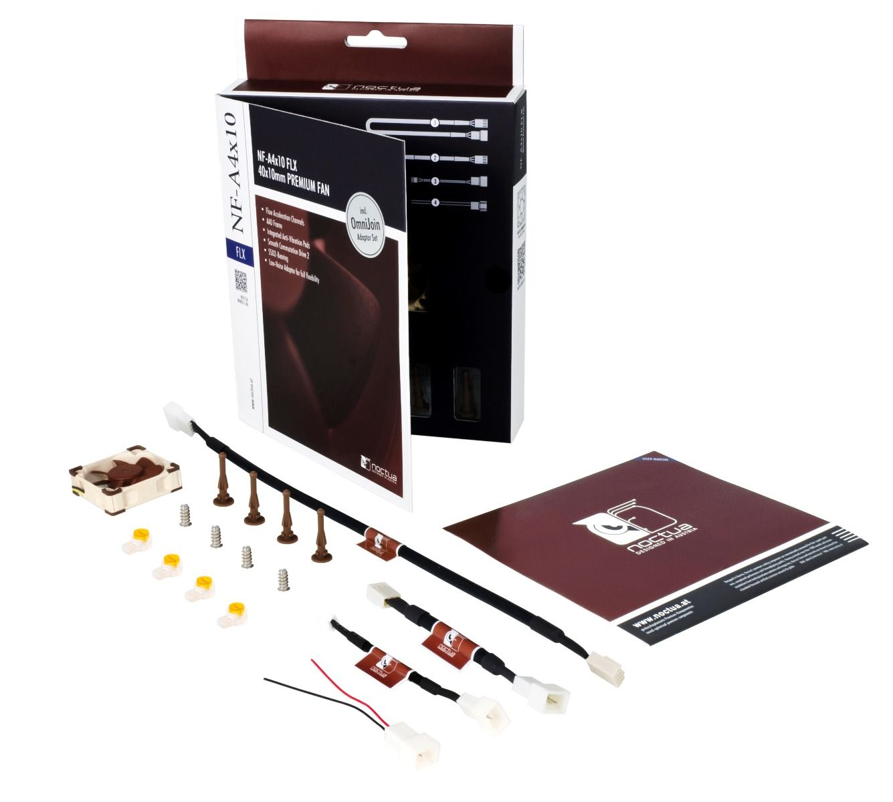

<!--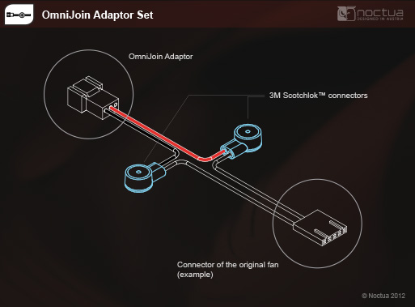-->
<center>
	
</center>

Opening the D2424 is very easy and you only need a phillips screwdriver to open the top chassis. Then you unmount the caddy bay by removing the screws on the sides, so that you can better access and remove the old fan. For that remove the 3 or 4 screws in its corners. I think you don't need to remove the fan's powercable from its socket and you can simply cut the fan off right were the cables go into it. The loose ends now can now be connected with the OmniJoin adapter.
Note that I had also removed the HDD bay's IDE 40pin and power cables, but I guess you don't have to.

This is how it looks in the end. I just needed to reconnect the IDE ribbon cable and reassemble everything.

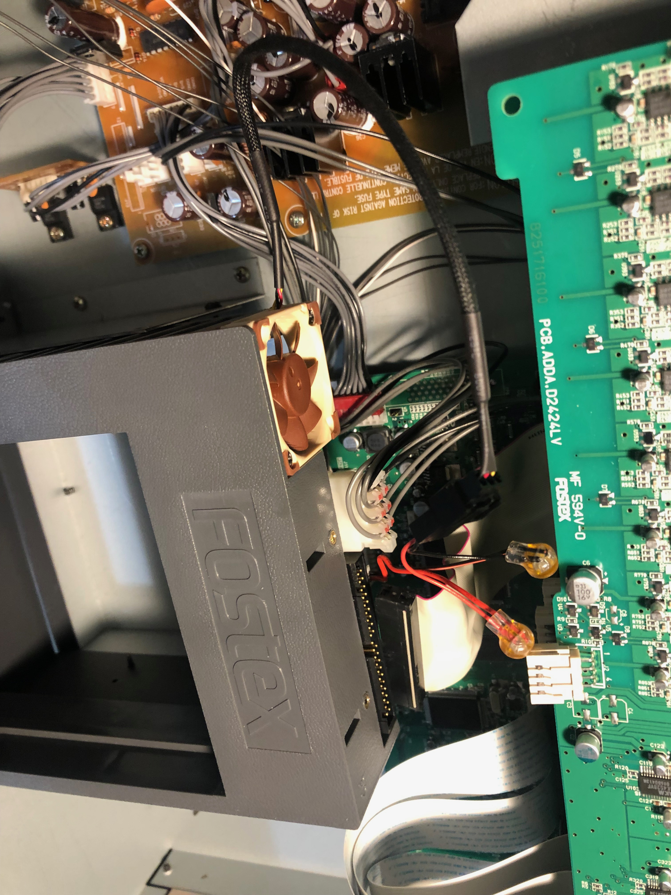


## Spinning disks in 2021?

Now that the device's fan was much more silent I could not stand hearing the IDE hard drive's clicking and whirring, so my goal was to use solid state storage which should be absolutely silent and may not even require a fan.

## IDE <-> SATA?

I bough two IDE<->SATA adapters so that I could use modern SATA-Disks or even SATA-SSDs with the D2424. First I tried a cheap one with the `JM20330`chipset and later another one with a `Marvell - 88SA8052` chipset:

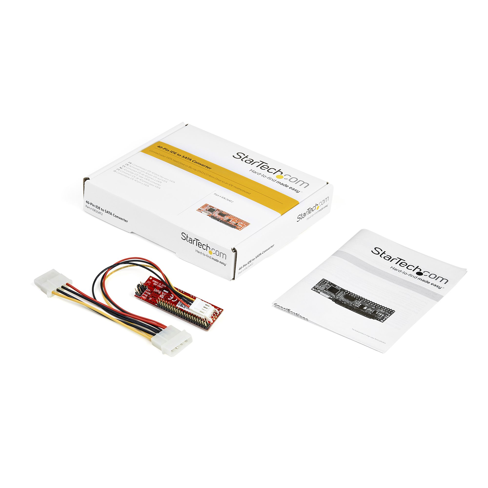

It was not very difficult to put such an adapter into the caddy in between the SATA disk and the IDE connector. However it may help to have a longer IDE cable at hand (about 10 cm, as the original one might be too short). Note that the adapter must be configured so that it behaves as an IDE master device by using the jumpers. The recorder recognized all SATA disks I tried even a Samsung 840 EVO and allowed to format them (I only use 24Bit @ 48Khz) in Quick-Format mode.

The latter adapter with the Marvell chipset worked much better than the former, but with all disks and both adapters I had gliches (clicks and pops) in the audio recordings. Even when only recording 2 tracks at a time! I was quite disappointed, as the adapters promised to support UDMA133 speed which should be enough and of course the SSD should be fast enough anyway. Maybe the conversion SATA<->IDE inroduces timing issues or delays that cause glitches in the audio. So that is a no-go.


## IDE/PATA SSD

Yes, they are hard to find and they're not necessarily fast, but I've tried a brand new Transcend 128 GB PATA SSD `TS128GPSD330` with acceptable results.

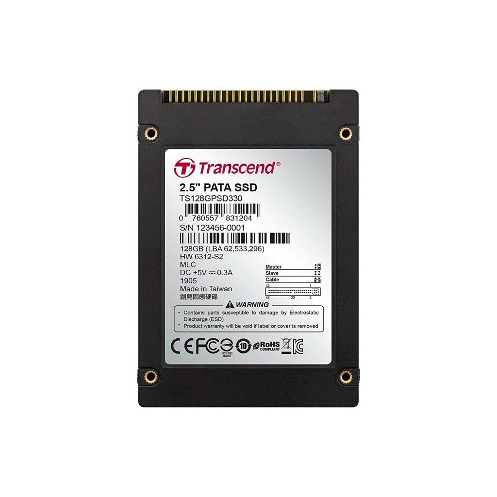

You need a 44 pin 2.5 laptop to desktop 40 pin IDE adapter such as the delock `Delock Converter IDE 40pin > 6.35cm 2.5Z HDD SSD`

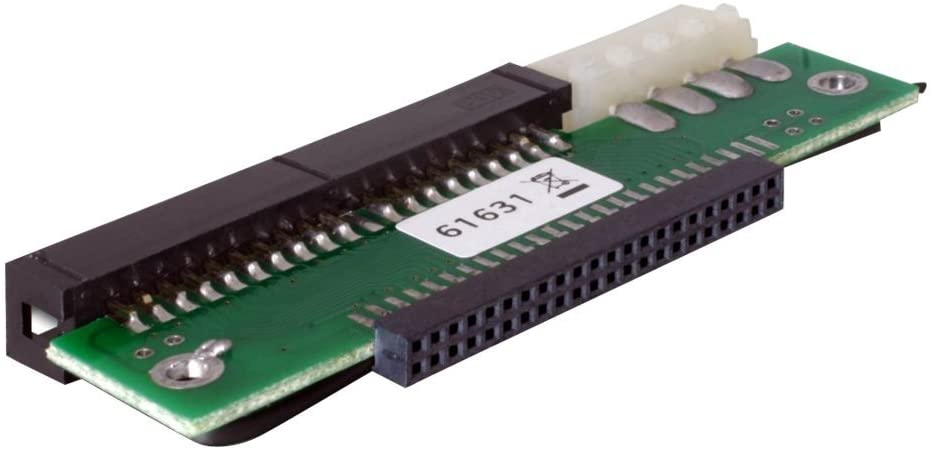

You can build it into the caddy and the D2424 will recognize it.

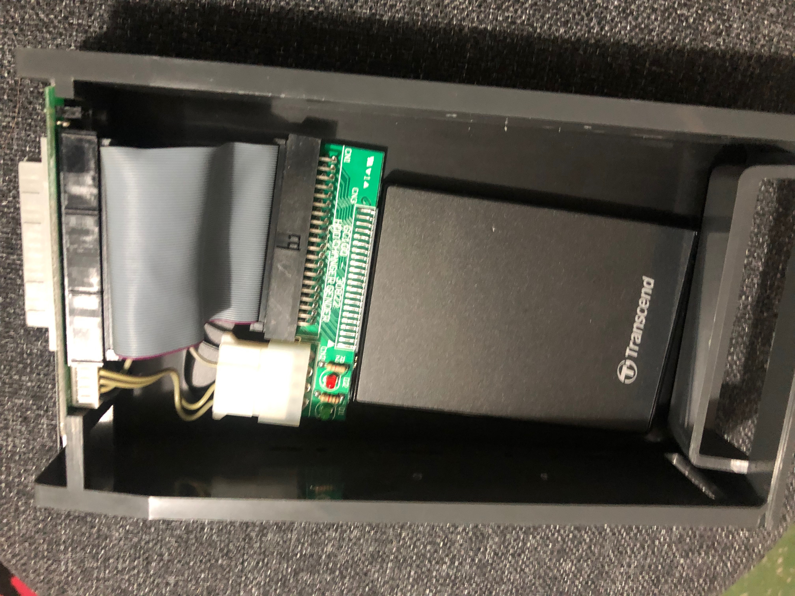


I was able to record 16 Tracks at once without audio glitches, so for recording in the home studio this is basically more than I need. It still has to prove that it'S woth the money, but so far it seems fine.

But wait... there's more... but beware you're entering the a bit more unpleasant territory.

## IDE <-> Compact Flash Card?

The logical alternative would be to try an IDE SSD so that no translation of protocols is needed. But IDE drives are hard to find, expensive and not very fast in terms of transfer rates anyway. So before risking another disappointment I looked around for a cheaper alternative. I realized that compact flash cards basically are (E)-IDE disks and that there exist IDE<->CF-card adapters. They more or less are passive devices that simply adapt the connectors. I bought the startech unit which had good reviews and comes in a nice form factor:
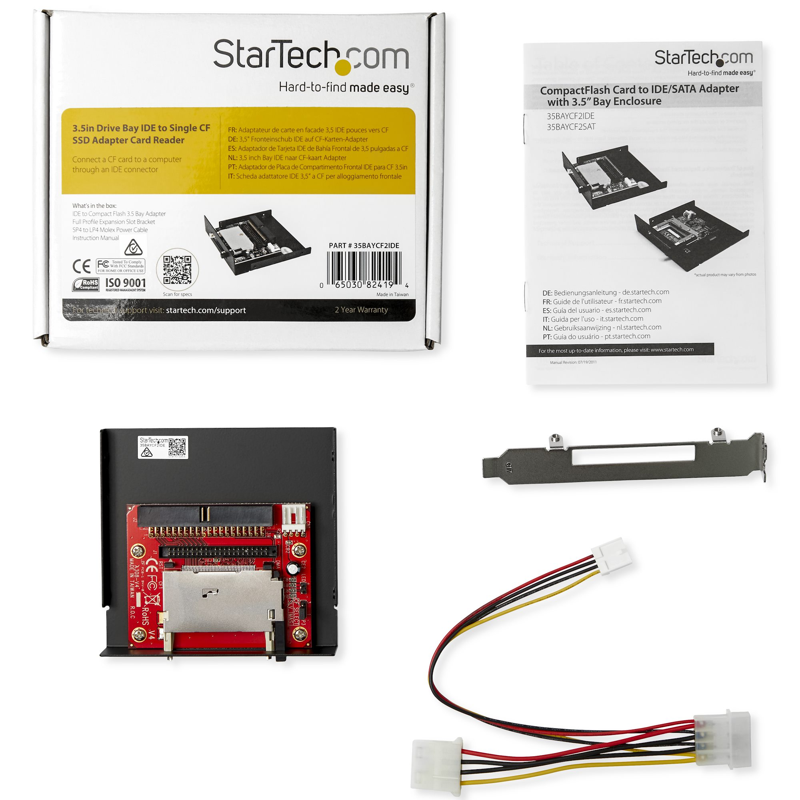

I built it into a caddy and used the top IDE1 bay for it:

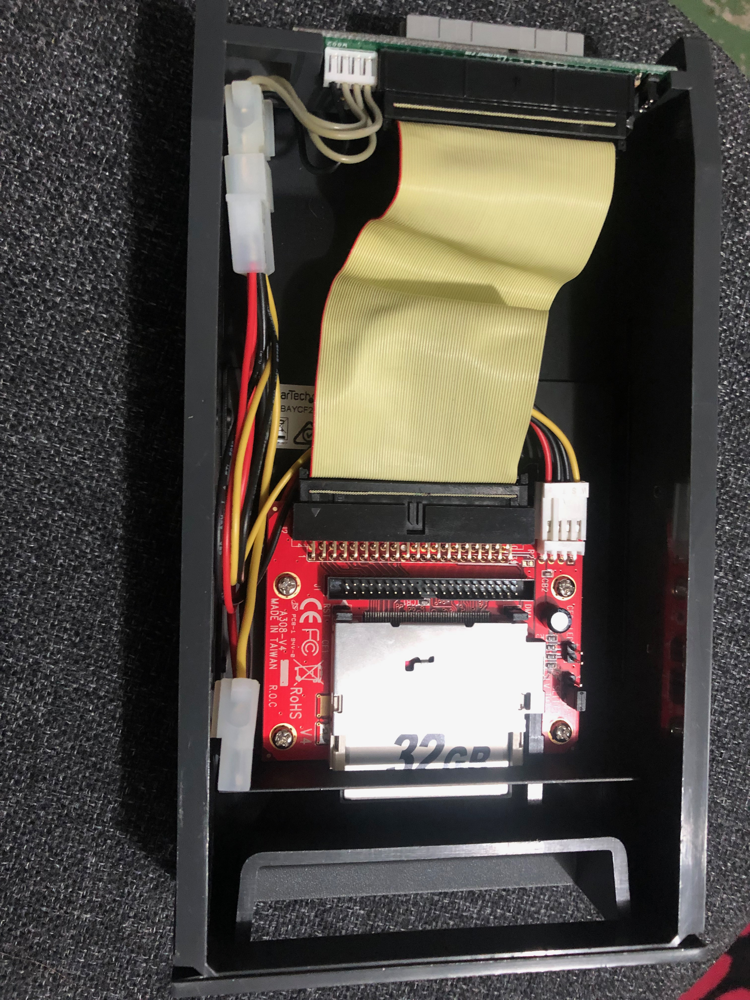

I have an old and probably very slow 1GB compact flash that came with a tascam multitracker and the D2424lv accepted it and allowed me to format it to 24Bit, 48kHz using the Quick-Format mode. However recording more that 4 Tracks caused glitches, but unlike with the IDE<->SATA adapter the audio had no clicks and pops. Instead the audio only stuttered occasionally. Recording two tracks seemed fine so I knew this could be the way to go. 
I wanted to try a newer CF card that I had laying around (a Sandisk Extreme 16 GB labeled with 60MB/s) but that's when the most frustrating part of this story began...

**"fixed disk" vs "removable"**

It turned out that the Sandisk CF reported itself as a removable disk whereas the 1GB CF appears to be a disk in "fixed disk" or "True IDE" mode. The D2424lv did only allow me to format "removable" CF cards in `16bit Backup` format which does not allow to record audio. I think I could not even chosse between 16 and 24 bit (see topic "IDE1 vs IDE2" below). By that time I did not know what this format was all about and concluded that the backup format was of no use to me and instead I should look out for "True-IDE" CF cards. Unfortunately nowadays all high performance consumer CFs are "removable" (which makes sense). The sad thing is that the difference between "fixed" and "removable" CF cards is just a single bit that once upon a time could be flipped using some software like "Lexar Bootit" or some sandisk utility. This is no longer possible and in order to get a "fixed" CF card you must buy so called "industrial" CF cards - at least Transcend sells such cards and explicitly states that those operate in "True-IDE" mode. Those have less capacity and slower nominal transfer rates than the cards you'll find from SanDisk or Lexar.

I tried the `Transcend CF170 Industrial CF-Cards 32 GB`

<!--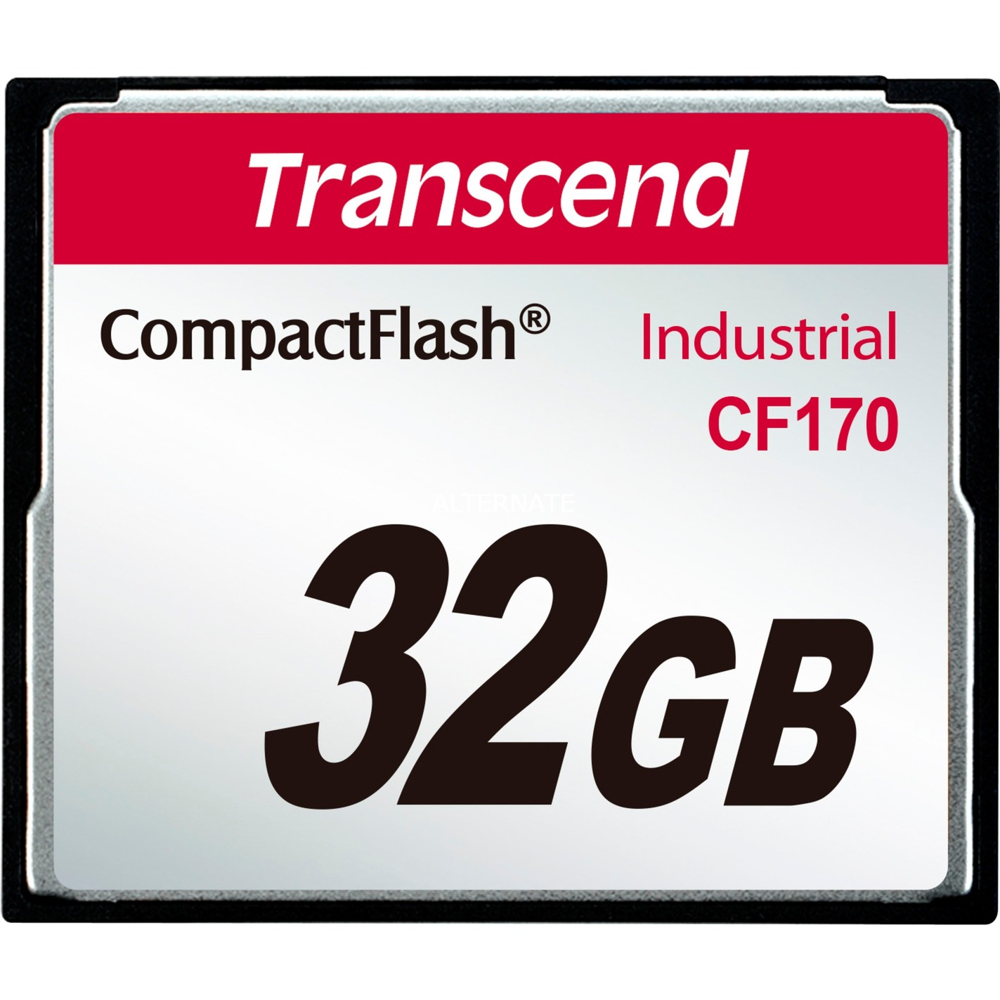-->
<center>

</center>
and sure enough, I could format it and with its 90MB/s read and 60MB/s write recording at least 8 tracks a time was possible without gliches.


## IDE1 vs IDE2
I wondered if I could take advantage of the second IDE port. I think IDE2 was meant for a DVD RAM drive and interestingly enough a CF card reader/writer for backup purposes. If you want to play around with IDE2 (in case your D2424 does not already come with IDE2 installed) you can connect a IDE cable to the HDD2 port. Once you have the chassis open you can carefully remove the three DA/AD converters. It's easy just unscrew the screws in the back and carefully grab all three at once and carefully put them asied (beware the cables ... be careful. Don't move them far). There you see both IDE ports:

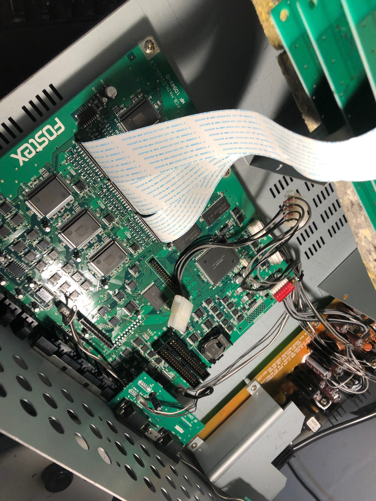

Note there's evern a second 4 pin IDE power socket. Hower I never got the device to not crash with two disks connected.

From my experience you should only use the IDE1 bay for all regular IDE drives and "fixed" CF disks. In IDE1 "removable" CF cards can only be formatted to the 16 Bit backup format. Fixed CF cards and regular disks can be formatted to the normal formats that allow recording. With the IDE<->CF adapter in IDE2 the port It seems that formatting "fixed" CF cards could not be formatted reliably, but "removable" CF cards could be formatted to 16 and 24 bit Backup format. This will become handy in the next section.


## Tricking the D2424lv to record on "removable" CF cards as well

Unfortunately I had already bought the fastest compact flash I could find in order to fully take advantage of UDMA133 (133MB/s) which is the maximum IDE can handle: Lexar Professional 64GB 1066x Speed 160MB/s:

<!--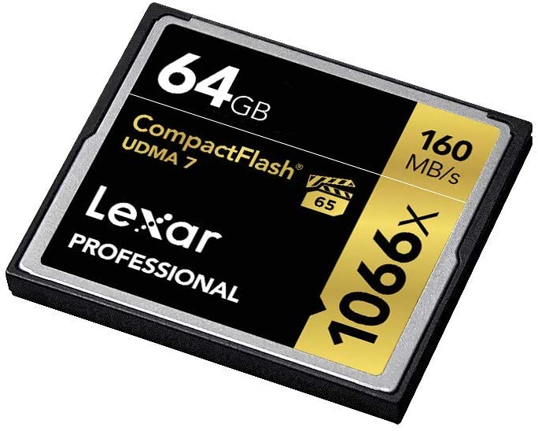-->
<center>
	
</center>
But as elaborated earlier the D2424lv only allowed me to format it in the "Backup" format which appeared useless to me. By cloning a few megabytes from a properly formatted disk (/dev/disk1) to a removable CF card (/dev/disk2 via USB card-reader) using something like `dd if=/dev/disk1 of=/dev/disk2 bs=1m count=4` will make the D2424lv accept it in (IDE1) for recording, but the available recording time was not reflecting the actual capacity of the CF card. This way I could at least use 32 GB on my Lexar CF 64 card. I cloned the first 40 megabytes (just a guess) from a the Transcend 32GB industrial formatted to 24bit@48Khz. In fact the Lexar card allows me to record 16 Tracks at once without glitches thanks to its higher performance. So that was already a success. But it bothered me to "loose" 32 GB.

It turned out that the Backup format is not very different from the regular FDMS3 format. Apparently there's basically almost no difference at all, since Tobias Lohner's version 2 of [FDMS3-Ripper](http://www.zilber.org/fdms3rip/) was able to read it just as well (I had to make some small modifications to make sox actually extract the wav files, but that's not the point here). Anyway, that then led me to compare the filesystem's header (513 blocks of 512 bytes each). Turns out that for my purposes only one byte needs to be altered. The fielsystem is not documented and I don't I was just lucky to identify it, because it differed when comparing images of both formats.

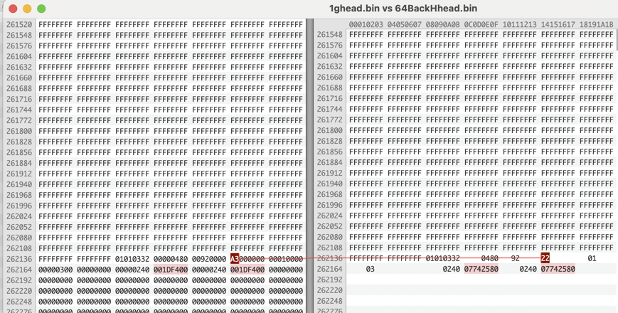

So here's the Trick: Let the D2424lv format your removable CF card in the appropriate Backup format 16 or 24 bit (of course you'll want 24 bits!), but do that in the IDE2 port. I did not get it to work otherwise. Now you need to modify a specific byte on the disk to change the drive from Backup to regular recording media.

I was able to get it to work in the following cases:

24 Backup -> 24bit 48Khz  
switch 0x4000c from 0x22 to 0xA3 (confirmed)

16 Backup -> 16bit 48Khz   
switch 0x4000c from 0x02 to 0x83 (not 100% sure, but who wants 16bits anyway...)

To do that use a hexeditor such as HexFiend on macOS or this python3 [script](setbyte.py):

```
#!/usr/bin/env python3
#file: set-byte

import sys

fileName = sys.argv[1]
offset = int(sys.argv[2], 0)
byte = int(sys.argv[3], 0)

with open(fileName, "r+b") as fh:
    fh.seek(offset)
    fh.write(bytes([byte]))
```

On macOS I used to alter a 24Bit Backup CF (in my case /dev/disk4 via CF USB card reader, use `diskutil list` to identify it and be very careful not to modify the wrong disk) from Backup to the regular "Quick Format" 24bit@48Khz.

`sudo python3 setbyte.py /dev/disk4 0x04000c 0xA3`

Note that it's unclear when multiple undo happens to be activated or not, I think I found the approriate bit, but I did not test flipping it. Look at the byte at 0x40009. I guess 0xB2 means single undo whereas 0x92 means multiple undo. I think the settings of the Backup depend on the D2424's current state.

Once this is done the removable Backup CF card (Lexar 1066x) is now recognized as recording media - with full capacity. In my case it reports 64GB FreeArea:

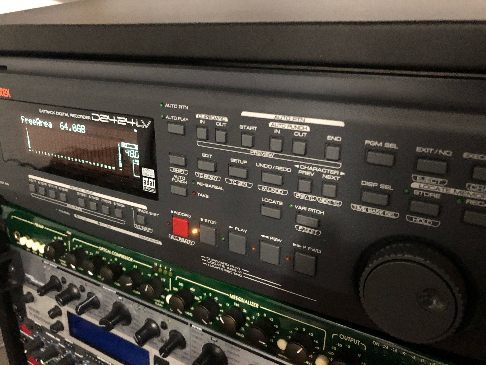

 However the **record protection** is still activated. You can turn that off in the Setup.

I hope you learned something. Do these things at your own risk.
